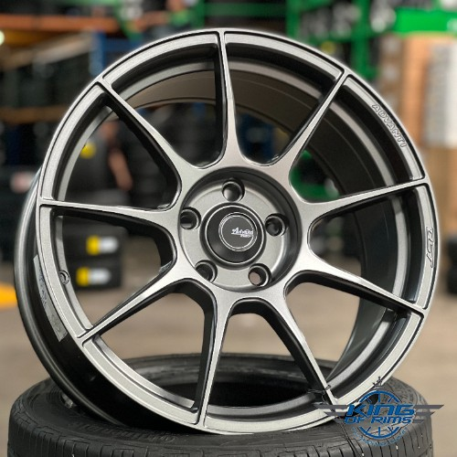

<!DOCTYPE html>
<html lang="ms">
<head>
    <meta charset="UTF-8">
    <meta name="viewport" content="width=device-width, initial-scale=1.0">
    <title>Kedai Alat Ganti Kereta</title>
    
</head>
<body>
    
Rizqi Garage

    

        <button onclick="showHome()">Home</button>
        <button onclick="showMenu()">Menu</button>
        <input type="text" id="search" placeholder="Cari barang..." onkeyup="searchItem()">
        
        

            
Hubungi kami di WhatsApp: <a href="https://wa.me/60123456789" style="color: yellow;">+60123456789</a>

        

       
        

            

                

                   
                    
Rim Kereta King 2.0- <b>RM350/pcs</b>

                

                

                    
                    
Cooler Kereta Alza- <b>RM80</b>

                

                

                   
                    
Stering drift - <b>RM100</b>

                

            

        

    

    
&copy; 2025 Kedai Alat Ganti Kereta

    
</body>
</html>
